# Capstone Project — Cloud-Native App on AWS

A fully cloud-native application built as the capstone project for a cloud internship at IIT Roorkee.

## Architecture

- **Frontend** — Static HTML/JS hosted on S3, served via CloudFront CDN
- **Backend** — Flask app containerized with Docker, running on EC2
- **Database** — PostgreSQL on RDS in a private subnet
- **IaC** — Terraform provisions all AWS infrastructure
- **CI/CD** — GitHub Actions: runs tests → builds Docker image → pushes to Docker Hub → deploys to EC2
- **Monitoring** — CloudWatch dashboard tracking EC2 and RDS CPU utilization

## Workflow

!

## Infrastructure (Terraform)

| Resource | Details |
|---|---|
| VPC | 10.0.0.0/16, DNS enabled |
| Subnets | 2 public + 2 private across 2 AZs |
| EC2 | t2.micro, Ubuntu 24.04, public subnet |
| RDS | db.t3.micro, PostgreSQL, private subnet |
| Security Groups | EC2 (ports 22, 5000), RDS (port 5432 from EC2 only) |

## Flask API Routes

| Route | Response |
|---|---|
| `/` | "testing docker and rds connection" |
| `/db-test` | PostgreSQL version as JSON |

## CI/CD Pipeline

1. Run pytest
2. Build Docker image
3. Push to Docker Hub (`divasince2005/my-flask-app:latest`)
4. SSH into EC2, pull new image, restart container

## Deployment

### Prerequisites
- AWS CLI configured
- Terraform installed
- Docker installed

### Steps
```bash
# Provision infrastructure
cd capstone-project
terraform init
terraform apply

# Frontend
aws s3 cp frontend/index.html s3://<your-bucket>/

# Backend runs via CI/CD on push to main
```

## CloudWatch Dashboard

Monitors EC2 CPU and RDS CPU in real time.
Region: ap-south-1

## Cost Estimate

All resources fall within AWS Free Tier limits (~$0/month).
See `cost-report.md` for details.